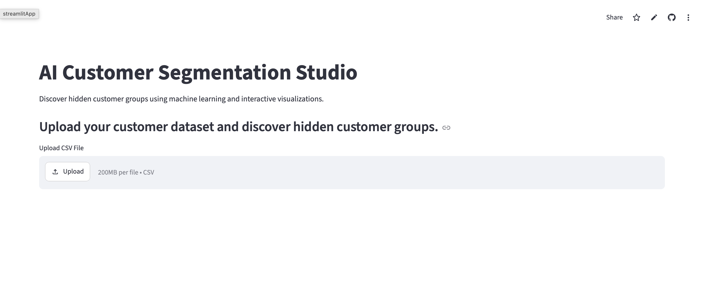
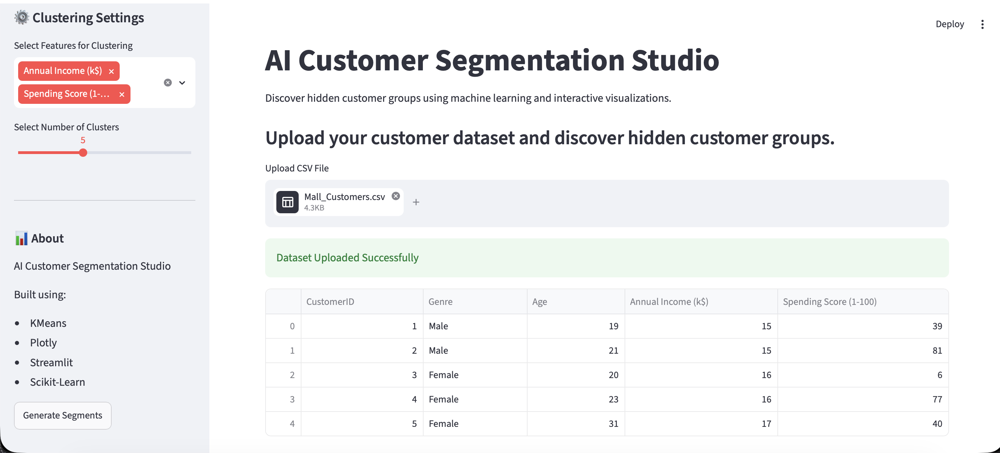
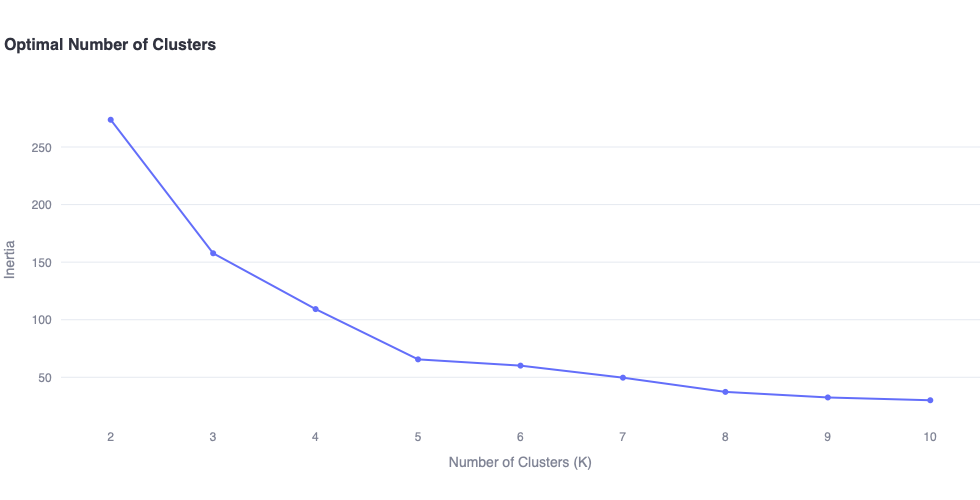
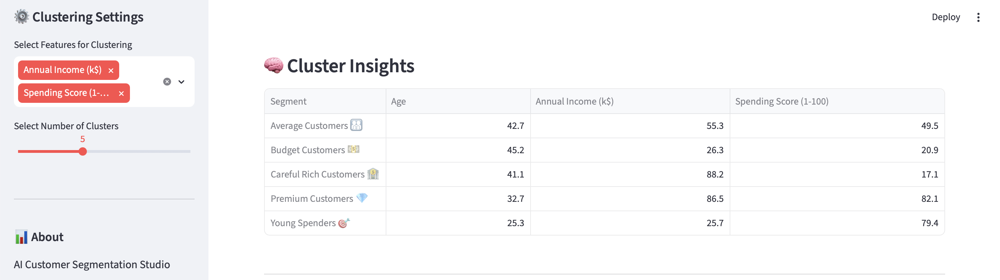
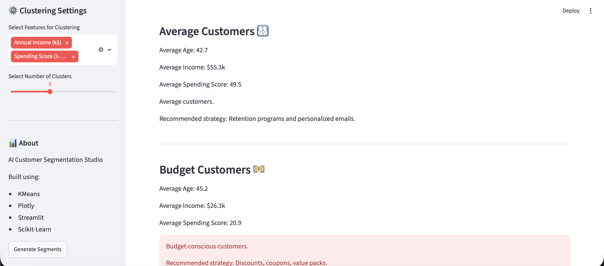
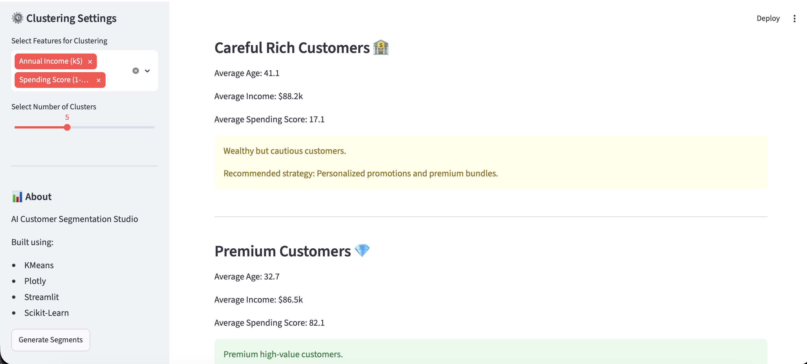
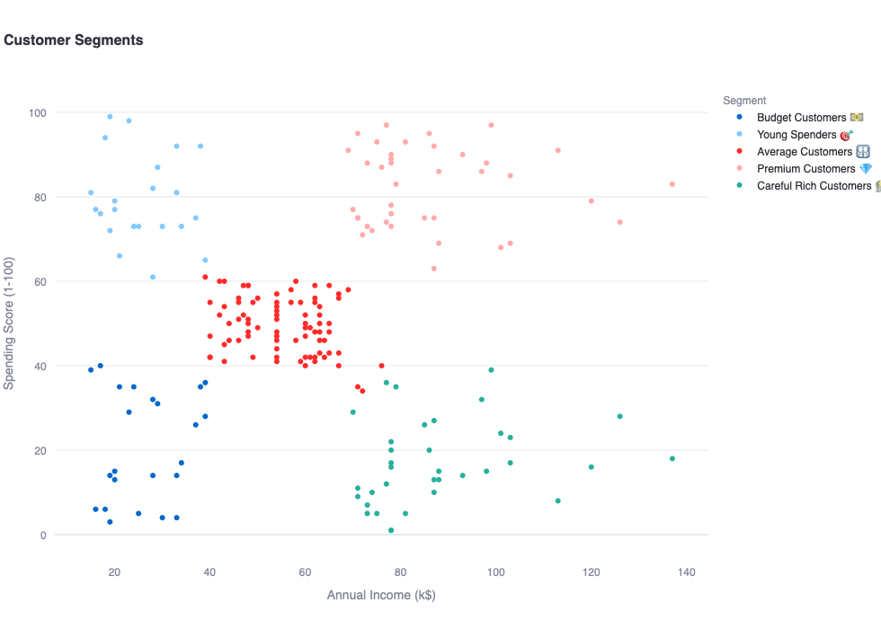
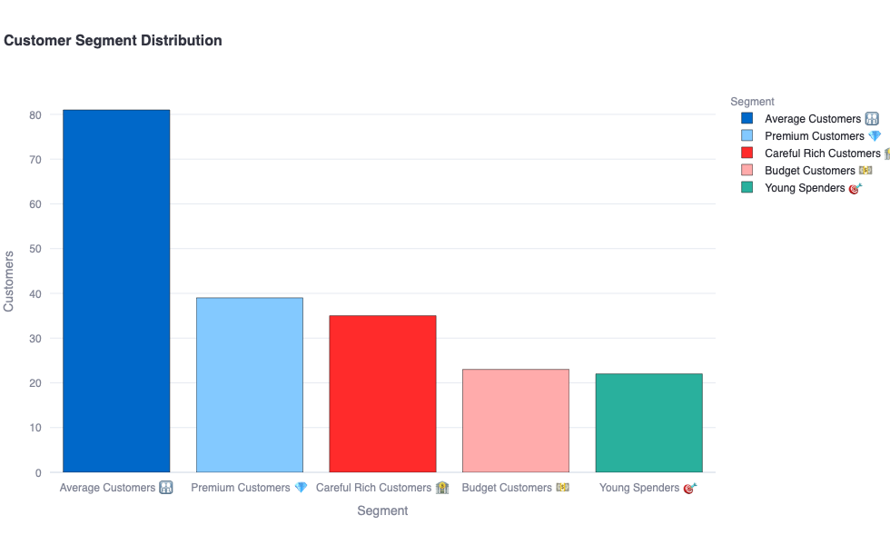

# 🛒 AI Customer Segmentation Studio


[](https://ai-customer-segmentation-studio-2407.streamlit.app/)

---

##  Project Overview

AI Customer Segmentation Studio is an interactive machine learning dashboard that helps businesses discover hidden customer groups and generate actionable business insights using unsupervised learning techniques.

The application allows users to upload customer datasets, perform clustering using K-Means, visualize customer segments, and receive business recommendations for each customer group.

---

##  Live Demo

https://ai-customer-segmentation-studio-2407.streamlit.app/

---

##  Features

###  Dataset Upload

* Upload customer datasets in CSV format.
* Supports custom customer datasets.

###  Dynamic Feature Selection

* Select any numerical features for clustering.
* No hardcoded dataset requirements.

###  K-Means Clustering

* Adjustable number of clusters.
* Real-time segmentation.

###  Elbow Method Visualization

* Helps determine the optimal number of clusters.
* Interactive Plotly visualization.

###  Interactive Dashboard

* Plotly-based customer segment visualization.
* Responsive and interactive charts.

###  Automatic Segment Identification

Segments are automatically categorized into:

* 💎 Premium Customers
* 🎯 Young Spenders
* 🏦 Careful Rich Customers
* 💵 Budget Customers
* 👨‍👩‍👧‍👦 Average Customers

###  Business Insights Generator

The application automatically generates marketing recommendations for every segment.

Example:

**Premium Customers 💎**

* High income
* High spending

**Recommended Strategy:**

* VIP memberships
* Loyalty programs
* Premium products

###  Export Results

* Download segmented datasets directly from the dashboard.

---

##  Machine Learning Pipeline

Dataset Upload
↓
Feature Selection
↓
Standard Scaling
↓
K-Means Clustering
↓
Customer Segmentation
↓
Business Insights
↓
Download Results

---

##  Dataset

The project was initially developed using the famous Mall Customers Dataset containing:

* CustomerID
* Gender
* Age
* Annual Income (k$)
* Spending Score (1-100)

The application can also work with custom customer datasets.

---

##  Tech Stack

### Machine Learning

* Scikit-Learn
* K-Means Clustering
* StandardScaler
* PCA

### Data Processing

* Pandas
* NumPy

### Visualization

* Plotly
* Matplotlib

### Web Application

* Streamlit

---

##  Project Structure

```text
AI-Customer-Segmentation-Studio/
│
├── app.py
├── requirements.txt
├── README.md
│
├── images/
│   ├── cluster_insights.png
│   ├── customer_segment_viz.png
│   ├── cluster_viz.png
│   ├── customer_segment_dist.png
│   ├── business_insights_1.png
│   ├── business_insights_2.png
│   ├── download_results.png
│   ├── dashboard_after_upload.png
│   └── dashboard_before_upload.png
│
├── dataset/
│   └── Mall_Customers.csv
└── notebook/
    └── customer_segmentation.ipynb
```

---

##  Installation

Clone the repository:

```bash
git clone https://github.com/Yuwin2008/AI-Customer-Segmentation-Studio.git
cd AI-Customer-Segmentation-Studio
```

Install dependencies:

```bash
pip install -r requirements.txt
```

---

##  Running the Application

Start Streamlit:

```bash
streamlit run app.py
```

Open your browser:

```text
http://localhost:8501
```

---

##  requirements.txt

```text
streamlit
pandas
numpy
scikit-learn
plotly
matplotlib
```

---

##  Screenshots

### Dashboard



### Elbow Graph(Cluster Visualization)


### Cluster Insights


### Business Insights



### Customer Segmentation



---

##  Future Improvements

* Automatic K recommendation using Silhouette Score
* Support for DBSCAN clustering
* Support for Gaussian Mixture Models
* Customer churn prediction integration
* PDF report generation
* Multi-dataset support
* Cloud deployment
* Real-time business analytics

---

##  Author

**GodofThunder2407(Yuwin)**

GitHub:
https://github.com/Yuwin2008

---

##  Support

If you found this project useful:

 Star the repository
 Fork the repository
 Share it with others

---

##  License

This project is licensed under the MIT License.
